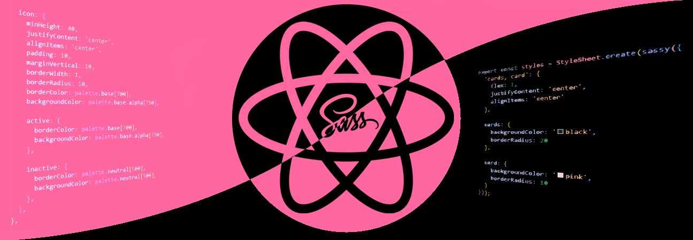

    

    

## ⚛️ About

Welcome to NativeSass! Here you will find a lot of productivity features for styling on your React Native projects. Enjoy nesting, shared styles, shorthand properties, and much more!
